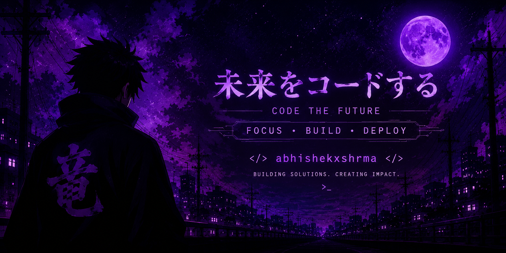

# Hi 👋, I'm Abhishek Sharma

### B.Tech CSE Student | Backend Learner | DSA Enthusiast | Future Software Engineer

---

## 🚀 About Me

- 🎓 B.Tech Computer Science Engineering
- 💻 Interested in Backend Development and Software Engineering
- 📚 Currently learning Data Structures, Algorithms, and System Design
- 🎯 Goal: Crack top software engineering placements
- 🔥 Improving problem-solving skills every day
- 🌱 Always learning something new

---

## 🛠 Tech Stack

### Languages

### Web Development

### Backend & Database

### Tools

---

## 📈 GitHub Statistics

---

## 🔥 GitHub Streak

---

## 📌 Featured Projects

### 🏥 Smart Medical Appointment System
Full-stack appointment booking system with patient and doctor management.

### 📚 DSA Practice Repository
Collection of solved problems and algorithms for interview preparation.

### 🌐 Backend Learning Projects
Projects built while learning Node.js, Express, and MongoDB.

---

## 🎯 2026 Goals

- Solve 500+ DSA problems
- Learn System Design fundamentals
- Build 5 strong full-stack projects
- Secure a software engineering placement
- Contribute to open-source projects

---

## 🤝 Connect With Me

---

### "Consistency beats intensity when practiced every single day."

⭐ Thanks for visiting my profile!

